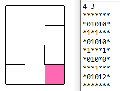
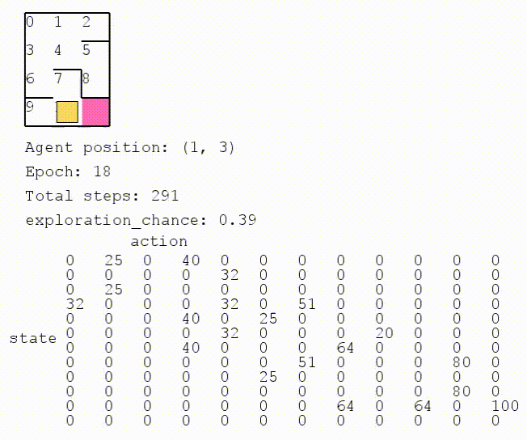
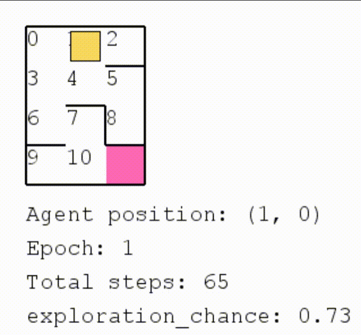
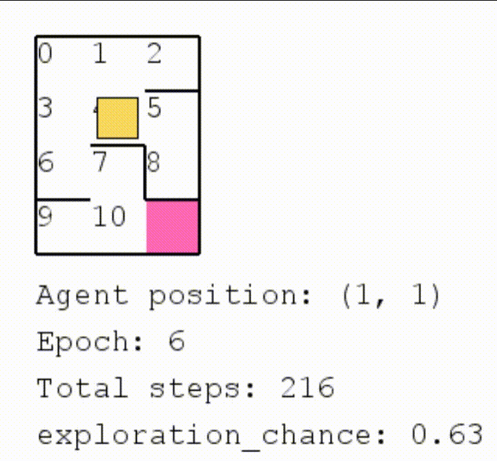

# q-learning-maze-solver

A visual representation of a q-learning algorithm solving a maze. The project is being developed with Python and pygame modules. 

Q-learning is a model-free reinforcement learning algorithm. Q-learning is also an unsupervised training algorithm and therefore it does not use examples or previously known references.

As of reinforcement learning, q-learning involves an agent, a set of states and a set of actions. In my application: 

* The agent is an entity (a yellow square) that wants to reach a target/goal position (a pink zone).
* A state would be the current position of the agent.
* A action would be the agent movement to an adjacent position.

Q-learning also involves a reward matrix (the R matrix) and a memory/knowledge matrix with all (state, action) pairs and values possible. Q-learning also features a random exploration chance, a chance to decide the next move randomly, to allow the agent to potentially discover new and more rewarding decisions. The random exploration chance will be decremented during the agent's training. Currently, the learning rate (gamma) is fixed at 0.8.

After each step, we adjust: Q(state, action) = R(state, action) + Gamma * Max[Q(next state, all actions)]

My application builds a map from a map file, currently in "maps" folder and using "maps/example_map.txt". The first represents the map height and the map width, respectively.

* '*': Indicates a wall or blocking object
* '0': An empty square
* '1': Indicates a path between two squares
* '2': Indicates goal position

Q-learning training: As the training goes on, the agent is learning, this learning is represented by the Q matrix being filled. (GIF below)

Untrained agent: As the Q matrix is filled with 0's and the exploration chance is high, most of the agent's decisions will be random as it has no knowledge. (GIF in slower motion below)

Trained agent: As the Q matrix is complete and the exploration chance is very low or simply 0%, the agent will pratically always know how to reach the goal/target map position. (GIF in slower motion below)

